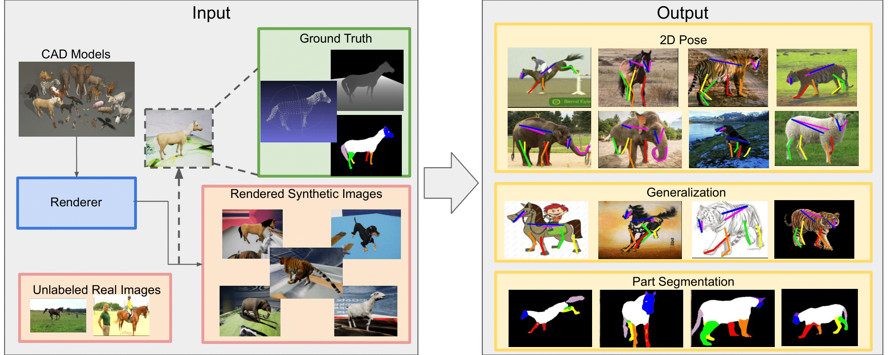

# Learning from Synthetic Animals

Code for [Learning from Synthetic Aniamls (CVPR 2020, oral)](https://arxiv.org/abs/1912.08265). The code is developed based on the Pytorch framework(1.1.0) with python 3.7.3. This repo includes training code for consistency-constrained semi-supervised learning plus a synthetic animal dataset.

## Citation

If you find our code or method helpful, please use the following BibTex entry.
```
@article{DBLP:journals/corr/abs-1912-08265,
  author    = {Jiteng Mu and
               Weichao Qiu and
               Gregory D. Hager and
               Alan L. Yuille},
  title     = {Learning from Synthetic Animals},
  journal   = {CoRR},
  volume    = {abs/1912.08265},
  year      = {2019},
  url       = {http://arxiv.org/abs/1912.08265},
  archivePrefix = {arXiv},
  eprint    = {1912.08265},
  timestamp = {Fri, 03 Jan 2020 16:10:45 +0100},
  biburl    = {https://dblp.org/rec/journals/corr/abs-1912-08265.bib},
  bibsource = {dblp computer science bibliography, https://dblp.org}
}
```

## Requirements
* PyTorch (tested with 1.1.0): Please follow the [installation instruction of PyTorch](http://pytorch.org/).
* Other packages, e.g. imgaug 0.3.0, opencv 4.1.1, scipy 1.2.1

## Installation
1. Clone the repository with submodule.
   ```
   git clone https://github.com/JitengMu/Learning-from-Synthetic_Animals.git
   ```

2. Go to directory `Learning-from-Synthetic-Animals/` and create a symbolic link to the images directory of the animal dataset:
   ```
   ln -s PATH_TO_IMAGES_DIR ./animal_data/
   ```

3. Download and pre-processing datasets:
    * Download [TigDog Dataset](http://calvin.inf.ed.ac.uk/datasets/tigdog/) and move folder `behaviorDiscovery2.0` to `./animal_data`.
    * Run `python Get_cropped_TigDog.py` to get cropped `TigDog` Dataset.
    * Download [Synthetic Animal Dataset](https://www.cs.jhu.edu/~qiuwch/animal/) with script `bash get_dataset.sh`.

## High level organization

* `./data` for train/val split and dataset statistics (mean/std).

* `./train` for training scripts.

* `./evaluation` for inference scripts

* `./CC-SSL` for consistency constrained semi-supervised learing.

* `./pose` for stacked hourglass model.

* `./data_generation` for synthetic animal dataset generation.

## Demo

1. Download the [checkpoint](https://www.cs.jhu.edu/~qiuwch/animal/) with script `bash get_checkpoint.sh` and the structure looks like:

```
checkpoint    
│
└───real_animal
│      │   horse
│      └   tiger
│    
└───synthetic_animal
       │   horse
       │   tiger
       └   others
   
```

2. Run the `demo.ipynb` to visualize predictions.
 
3. Evaluate the accuracy on TigDog Dataset. (18 per joint accuracies are in the order of left-eye, right-eye, chin, left-front-hoof, right-front-hoof, left-back-hoof, right-back-hoof, left-front-knee, right-front-knee, left-back-knee, right-back-knee, left-shoulder, right-shoulder, left-front-elbow, right-front-elbow, left-back-elbow, right-back-elbow)

```
CUDA_VISIBLE_DEVICES=0 python ./evaluation/test.py --dataset1 synthetic_animal_sp --dataset2 real_animal_sp --arch hg --resume ./checkpoint/synthetic_animal/horse/horse_ccssl/synthetic_animal_sp.pth.tar --evaluate --animal horse
```

## Train

1. Training on synthetic animal dataset.

```
UDA_VISIBLE_DEVICES=0 python train/train.py --dataset synthetic_animal_sp -a hg --stacks 4 --blocks 1 --image-path ./animal_data/ --checkpoint ./checkpoint/horse/syn --animal horse
```

2. Generate pseudo-labels for TigDog dataset and jointly train on synthetic animal and TigDog datasets.

```
CUDA_VISIBLE_DEVICES=0 python CC-SSL.py --num-epochs 60 --checkpoint ./checkpoint/horse/ssl/ --resume ./checkpoint/horse/syn --animal horse
```

3. Evaluate the accuracy on TigDog Dataset using metric PCK@0.05.

```
CUDA_VISIBLE_DEVICES=0 python ./evaluation/test.py --dataset1 synthetic_animal_sp --dataset2 real_animal_sp --arch hg --resume ./checkpoint/horse/ssl/synthetic_animal_sp.pth.tar --evaluate --animal horse
```

**Please refer to [TRAINING.md](TRAINING.md) for detailed training recipes!**

## Generate synthetic animal dataset using Unreal Engine

1. Download and install the `unrealcv_binary` for [Linux](https://cs.jhu.edu/~qiuwch/animal) (tested in Ubuntu 16.04) with `bash get_unrealcv_binary.sh`

2. Run unreal engine. 

```
DISPLAY= ./data_generation/unrealcv_binary/LinuxNoEditor/AnimalParsing/Binaries/Linux/AnimalParsing -cvport 9900
```

3. Run the following script to generate images and ground truth (images, depths, keypoints)

```
python data_generation/unrealdb/example/animal_example/animal_data.py --animal horse --random-texture-path ./data_generation/val2017/ --use-random-texture --num-imgs 10
```
Generated data is saved in `./data_generation/generated_data/` by default.

4. Run the following script to generate part segmentations (support horse, tiger)

```
python data_generation/generate_partseg.py --animal horse --dataset-path ./data_generation/generated_data/
```

## Acknowledgement

* Wei Yang's [Stacked Hourglass Model](https://github.com/bearpaw/pytorch-pose)

* Yunsheng Li's [Bidirectional Learning for Domain Adaptation of Semantic Segmentation](https://github.com/liyunsheng13/BDL)

